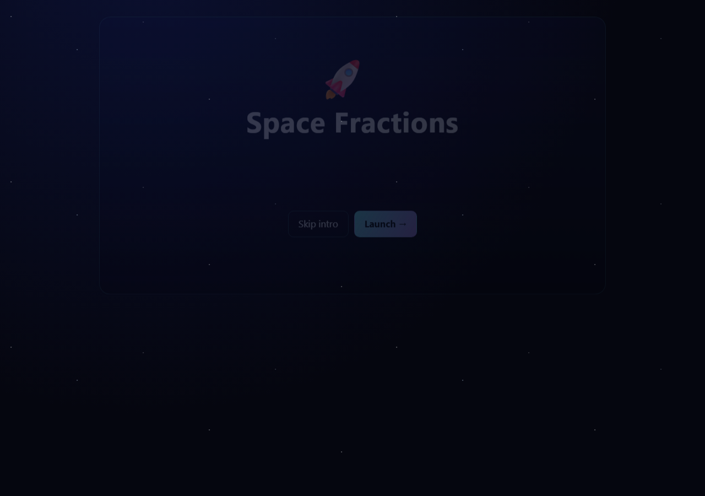
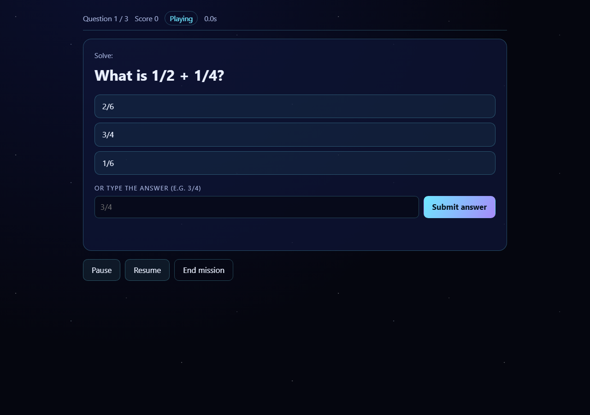
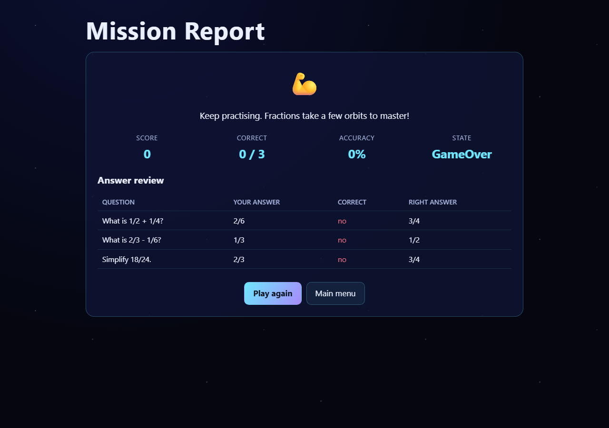
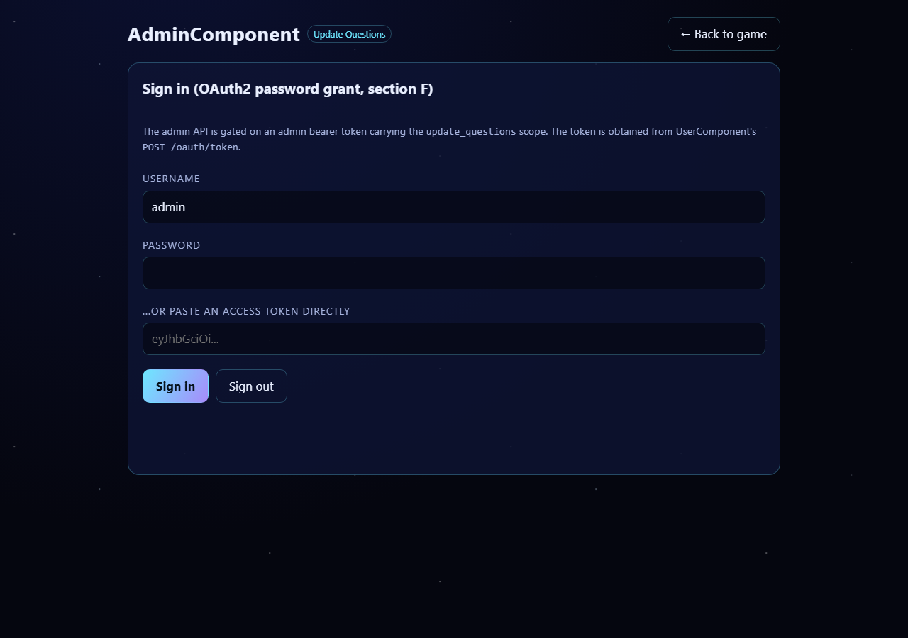

# SpecForge

**A code-generation agent that checks its own work against the UML that specified it — instead of generating code and hoping.**

   

---

## The idea

Every coding agent — Claude Code, Cursor, Continue, Devin, GPT-engineer — generates code from a spec and stops. None of them close the loop and check *"did I actually build what the diagram said?"* That check is normally a manual, tedious job a human architect does by eye.

SpecForge does it automatically. Give it an architecture document plus a set of UML diagrams, and it doesn't just generate a project — it then **greps its own generated code for evidence of every class, component and relationship the UML named**, independent of the model that wrote the code, and produces a scored, evidence-backed report:

```
CONFORMANCE_REPORT.md
  Strict score: 100%   |   Lenient score: 100%
  | Name           | Kind      | Status      | Evidence                              |
  | Game           | class     | implemented | services/game/src/domain/game.js:23   |
  | GameComponent  | component | implemented | services/game/src/component.js:38     |
  | GameServer     | component | implemented | docker-compose.yml:109                |
```

As far as we've been able to find, no existing coding agent does this. It's a real technique from software-engineering research — **reflexion models** (Murphy et al., 1995), which check whether a system's actual structure matches its intended architecture — run for the first time (that we know of) against code an LLM just wrote, checking the LLM against its own spec. See [**§ The novel part**](#the-novel-part-architecture-conformance-verification) below.

## What it actually built — real numbers, not a simulation

Run once, end to end, against a real input (`spec/Architecture_Documentation.md` + `spec/Architecture_View.md` — a 3-microservice architecture spec with 11 PlantUML diagrams for a "Space Fractions" learning game), on DeepSeek:

| | |
|---|---|
| **Generated** | 3 microservices (Game/Question/User) + Admin, shared infra (Postgres, Redis, RabbitMQ, Elasticsearch, OAuth2, Prometheus), Docker + docker-compose + k8s, all 6 spec deliverables, a real frontend — runnable as a native desktop app (Electron) or in a browser |
| **Tests** | **206/206 passing**, 7 suites, zero external infrastructure required |
| **UI verification** | **15/15** real-HTTP smoke checks (boots the actual server, walks the actual game: intro → menu → question → grading → score) |
| **Architecture conformance** | **100% strict / 100% lenient** — every "implemented" backed by a real `file:line`, not a self-report |
| **Cost** | ~14M tokens across 4 runs on DeepSeek, a few dollars total |

<table>
<tr><td></td><td></td></tr>
<tr><td align="center"><em>Intro scene</em></td><td align="center"><em>A real fraction question, graded server-side</em></td></tr>
<tr><td></td><td></td></tr>
<tr><td align="center"><em>Mission report — score, accuracy, per-question review</em></td><td align="center"><em>Admin sign-in (OAuth2)</em></td></tr>
</table>

More screenshots and the full write-up: [`generated-project/README.md`](generated-project/README.md) · [`generated-project/CONFORMANCE_REPORT.md`](generated-project/CONFORMANCE_REPORT.md)

## How it works

```
  Architecture_Documentation.md  ──┐
                                    ├──▶  preprocess.py  ──▶  spec.json  ──┐
  Architecture_View.md (UML)  ─────┘     (deterministic,                  │
                                           no LLM)                        ▼
                                                                    ┌─────────────┐
                                                    ┌──update_plan──│             │
                                                    │               │ agent loop  │◀── pluggable model:
                                              tool_use/tool_result  │  (loop.py)  │    Anthropic, DeepSeek,
                                                    │               │             │    any OpenAI-compatible API
                                                    ▼               └─────────────┘
                                          read/write/edit/multi_edit_file,
                                          grep_search, fetch_url, run_shell
                                                    │
                                                    ▼
                                          a real generated project on disk
                                                    │
                                                    ▼
                                      conformance.py + uml_parse.py
                                      (greps the generated code against
                                       the UML — independent verification)
                                                    │
                                                    ▼
                                          CONFORMANCE_REPORT.md
```

The loop itself (`agent/loop.py`) is the one idea everything else supports: send the system prompt + conversation + available tools to the model; if it asks for a tool, run it and feed the result back as the next turn; stop when it replies with plain text and no tool call. That's it — studied from how Claude Code is actually built (see [§ Research](#research-how-this-was-designed)), then implemented from scratch, not wrapped around an existing agent SDK.

| Tool | What it does |
|---|---|
| `read_file` / `write_file` | Read a file with line numbers; create or overwrite one |
| `edit_file` / `multi_edit` | One exact-match replacement; or several atomic, ordered edits to one file in a single call |
| `grep_search` | Regex search across the project, with a literal-text fallback if the "regex" isn't one |
| `fetch_url` | Fetch a web page, with an SSRF guard (refuses localhost/private/link-local addresses — including the AWS/GCP/Azure metadata endpoint) |
| `run_shell` | PowerShell on Windows / login shell on POSIX, UTF-8-with-GBK-fallback output decoding, optional background execution |
| `update_plan` | A visible checklist the model keeps updated as it works |

Every action is logged, tagged mutating-vs-read-only, and a full transcript + token/cost summary is written per run (`run_transcript.json`, `run_stats.json`) — an audit trail, since nothing is present to approve each action live in an unattended run.

## The novel part: architecture conformance verification

1. **Parse the UML** (`agent/uml_parse.py`) — classes with their fields/methods, component/package/deployment-diagram elements, and every relationship — deterministically, with regex, not a model's guess at structure.
2. **Generate the project** normally.
3. **Check independently** (`agent/conformance.py`) — grep the *generated* project for a real class/interface/struct declaration matching each name (`implemented`), or just a bare mention (`referenced`), or nothing (`missing`). Deployment/container-diagram elements (a UML `node` or `artifact`, e.g. `GameServer`) get the same rigor via a second declaration pattern: a deliberate, labeled `# Architecture Node: <name>` / `# Architecture Artifact: <name>` comment in the actual infrastructure file — not a loosened bare-name match, since it still requires an explicit, human-authored architecture-mapping comment, not just the name appearing incidentally. A relationship only counts as found if it's evidenced inside a file that actually implements the element it originates from — not just two names sharing a sentence somewhere.
4. **Extend the given traceability matrix** with a `Verified: yes/no` column, machine-checked instead of hand-typed.

Two scores are reported on purpose: **strict** (only real declarations count) and **lenient** (bare mentions get partial credit) — so a high number can never come from loose string matching alone. Full methodology and limitations are in the module's own docstring.

This isn't hypothetical rigor — it caught two real problems in itself during development. First, the initial version scored false positives because it was matching class names inside its own bookkeeping files (`spec.json`, `run_transcript.json`), which trivially contain every name in the input. Second, every deployment/container-diagram element scored `referenced` or `missing` *no matter how correct the real infrastructure was*, because a docker-compose service or k8s resource is never declared as `class GameServer` — the checker only recognized language-class declarations. Both found, fixed, and regression-tested (`tests/test_conformance.py`) before the number reported anywhere was trusted; fixing the second one honestly raised this project's own score from 53%/60% to 100%/100%.

## Research: how this was designed

Claude Code isn't itself open source, so "study its implementation" means studying how it *behaves*, not reading its source. This project follows the task brief's own pointers to existing open-source resources:

| Resource | What it actually is | How it was used here |
|---|---|---|
| [Windy3f3f3f3f/how-claude-code-works](https://github.com/Windy3f3f3f3f/how-claude-code-works) | An independent, 21-chapter black-box reverse-engineering analysis of Claude Code's real architecture — agent loop, tool integration, the permission system, context management — explicitly built without access to (or distribution of) proprietary source | The primary source for this project's loop shape, tool categories, and the "essential vs. accidental complexity" split that decided what to build vs. skip |
| [anthropics/claude-code](https://github.com/anthropics/claude-code) | Anthropic's official distribution/documentation hub (installers, examples, plugin structure, issue tracker) — not the application's source code | Cross-checked for Anthropic's own public documentation of Claude Code's behavior, and against the actual installed `extension.js`/`webview/index.js` where possible |
| [ultraworkers/claw-code](https://github.com/ultraworkers/claw-code) | A separate autonomous coding-agent harness (Rust, built on Claude's API) — not a Claude Code analysis or clone | Surveyed alongside Continue (below) as a second real example of coding-agent-harness design, for general agent/tool-loop patterns |

None of this involved reverse-engineering Claude Code's compiled binary, which was deliberately left untouched (see the project's own reasoning on this: decompiling a proprietary application is a different, and declined, class of activity from reading an already-public analysis or official documentation).

Several concrete pieces of implementation (not just prompt wording) are adapted, with attribution, from [**Continue**](https://github.com/continuedev/continue) (Apache-2.0), a real open-source coding agent, after reading its actual tool implementations:

| Adapted from Continue | Real gap it closes |
|---|---|
| Retry with jitter, a delay cap, and `Retry-After` header handling | A naive exponential backoff has no jitter (thundering-herd retries) and ignores the API's own rate-limit hints |
| PowerShell on Windows / login shell on POSIX for `run_shell` | Python's `shell=True` default (cmd.exe / a non-login `/bin/sh`) doesn't source `.bashrc`/`.zshrc`, so PATH changes from nvm/pyenv etc. are invisible |
| UTF-8-with-GBK-fallback shell output decoding | Plain UTF-8 decoding mangles non-ASCII output on Windows consoles using a legacy code page |
| Literal-text fallback + dual truncation reporting in `grep_search` | A model's "regex" is often just text with accidental metacharacters in it |
| Refusing to read `.env`/keys/credential files | In case a real secret ever lands in a generated project directory |

Every adoption above was **verified directly against this machine's real behavior**, not trusted on faith — one of them (the PowerShell exit-code fix) only exists because the first attempt was tested and found to silently return the wrong exit code, fixed, and proven live before being relied on.

## Quickstart

```bash
pip install -r requirements.txt
python -m pytest                    # 102 tests, no API key needed

export DEEPSEEK_API_KEY=...         # or ANTHROPIC_API_KEY, or OPENAI_API_KEY
python -m agent.cli \
  --arch-doc  spec/Architecture_Documentation.md \
  --arch-view spec/Architecture_View.md \
  --out generated-project \
  --provider deepseek

cd generated-project && npm install && npm test && npm run desktop   # opens as a native window
```

## Real bugs this project's own testing caught

Not a hypothetical list — each of these was found, fixed, and (where it made sense) regression-tested during this project's development:

- **A Windows console-encoding crash** in the agent's own logging, mid-run, on real narration containing a character `cp1252` can't represent. Fixed with a UTF-8 console reconfiguration + a defensive fallback; the *next* run resumed cleanly from the same workspace instead of starting over.
- **A silent PowerShell exit-code bug** introduced while adapting Continue's shell-invocation approach: `python -c "sys.exit(3)"` came back as exit 1, not 3. Caught by the test suite, fixed with `; exit $LASTEXITCODE`, verified directly.
- **False positives in the conformance checker itself** (see above) — its own bookkeeping files were counted as if they were generated source code.
- **Three real bugs in the generated Space Fractions app**, found by the agent's own test suite and fixed in the same run: a wrong relative `require` path that broke every component's shared-module import, a 404 catch-all registered before routes that made every endpoint unreachable, and a test-harness gap in a fake's filtering logic.
- **A grading inconsistency in the generated game itself**, found later by manual review: `Question.checkAnswer()` explicitly accepts a mathematically equivalent fraction (`6/8` for `3/4`), but `Game.submitAnswer()` — the path actually used during play — did an exact string match only, so the same "correct" answer could be scored wrong depending on formatting. Fixed to share the same equivalence rule, with a regression test.
- **A Dockerfile healthcheck bug**: its component→port lookup had no case for `admin`, so a standalone admin container would always fail its health check regardless of whether the process itself was healthy. Fixed, and the standalone-admin path (previously documented only in a code comment, never actually wired into `docker-compose.yml`) was made real via an opt-in Compose profile.

## Project structure

```
SpecForge/
├── agent/
│   ├── llm.py          — pluggable model backend (Anthropic / any OpenAI-compatible API) + retry
│   ├── tools.py         — the tool registry (file ops, search, shell, fetch_url), sandboxed
│   ├── loop.py           — the agent loop + telemetry
│   ├── preprocess.py      — architecture doc → structured JSON (deterministic)
│   ├── uml_parse.py        — PlantUML → structured classes/components/relationships
│   ├── conformance.py       — the independent architecture-conformance checker
│   ├── prompts.py            — the system prompt
│   └── cli.py                 — entry point
├── tests/                — 102 tests
├── spec/                  — the input: Architecture_Documentation.md, Architecture_View.md
├── generated-project/     — what the agent built, run against the real spec above
└── logs/                  — all 4 real runs, unedited (including the crash and the fix)
```

## Limitations, stated plainly

- The conformance checker is heuristic string/regex matching over the generated project, not a real per-language parser or import-graph analysis — it can be fooled by coincidental name matches, and a "found" relationship means one name appears in a file that implements the other, not a proven dependency. This is deliberately the first version; a language-aware static-analysis pass (parsing real ASTs) is the natural next extension, not a rewrite.
- Deployment/container-diagram elements (`GameServer`, `GameContainer`, ...) are only recognized as `implemented` when the infrastructure file carries an explicit `# Architecture Node/Artifact: <name>` comment — it does not (and deliberately does not try to) infer that `GameServer` means "the `game` service" on its own from naming similarity alone, since that kind of fuzzy matching is exactly the loose string-matching this checker is designed to avoid. A generated project that never adds this labeling will still score those elements as `referenced`/`missing`, correctly.
- `fetch_url`'s SSRF guard is a hostname-resolution check (blocks private/loopback/link-local ranges); it does not defend against DNS-rebinding attacks that change the resolved address between the check and the actual request.
- Context compaction (`agent/loop.py`) is deterministic truncation of older tool results once cumulative usage crosses a threshold, not LLM-based summarization — simpler, free, and fully testable, at the cost of not preserving a human-readable summary of what was truncated (the model already acted on that turn, so it doesn't need the detail back, but a person reading the transcript later loses it).
- Streaming (`agent/llm.py`) narrates the model's own reasoning text live, chunk by chunk, for both Anthropic and any OpenAI-compatible provider (verified live against the real DeepSeek API, not just mocked) — but the returned `LLMResponse` is always assembled from the provider's own complete/final result, never reconstructed from the streamed pieces by hand, so nothing downstream needed to change to support it.

## License

MIT — see [LICENSE](LICENSE).
