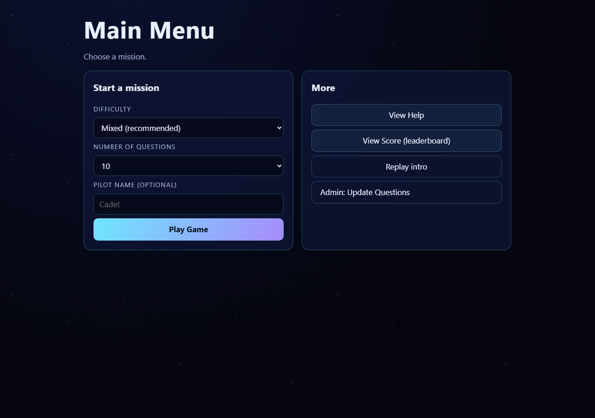

# Space Fractions

A microservices implementation of the **Space Fractions** system: a web-based interactive
learning tool that improves fraction-solving skills for sixth-grade students. Generated by
SpecForge from `spec.json` (a parsed architecture document plus 11 PlantUML views).

- **Architectural style:** Microservices
- **Deployment topology:** Cloud-based infrastructure
- **Stack (spec §D recommended defaults):** Node.js 18, Express 4, PostgreSQL 14, Redis 6,
  RabbitMQ 3, Elasticsearch 7, OAuth2, Prometheus 2, Docker 20 (Jenkins 2 / Terraform 1 for CI and provisioning)

## Screenshots

Real screenshots of the real running app (Chromium via Playwright, against `node scripts/dev-server.js`
— no Docker, no mocking of the screenshots themselves, only the external infra behind the API is faked).

| Intro | Main menu |
|---|---|
|  |  |

| Question | Mission report (ending) |
|---|---|
|  |  |

| Admin sign-in |
|---|
|  |

---

## 1. What was generated

### Components (spec §C / §D / ComponentDiagram)

Each spec component is a separately deployable service with its own entry-point class named
exactly as the spec names it, so every name in the traceability matrix resolves to a real symbol.

| Component | Entry point | Responsibility | Owns |
| --- | --- | --- | --- |
| `GameComponent` | `services/game/src/component.js` | Game logic and user interaction | `game.games` |
| `QuestionComponent` | `services/question/src/component.js` | Question management and data persistence | `question.questions` |
| `UserComponent` | `services/user/src/component.js` | User authentication and authorization | `user_svc.users`, `user_svc.refresh_tokens` |
| `AdminComponent` | `services/admin/src/component.js` | Admin surface: Update Questions (spec UseCaseDiagram), game stats | none (composes over QuestionComponent's data) |

The class layer beneath each component carries the ClassDiagram's own names: `Game`,
`Question`, `User`, `Admin` (domain), and `GameService`, `QuestionService`, `UserService`
(application layer).

**`AdminComponent`** is named in the ComponentDiagram but not in the spec's component list or
traceability matrix. It is a real module — `services/admin/` with its own class
(`services/admin/src/component.js`), routes (`services/admin/src/routes/adminRoutes.js`), service
(`services/admin/src/service/adminService.js`), and optional standalone entry point
(`services/admin/src/server.js`, `npm run start:admin`, `ADMIN_PORT` 8084). It is hosted **inside**
the GameComponent process by default via `adminComponent.mountOn(app)` under `/api/v1/admin`
(a real mounted router), and GameComponent's `component.js` also wires it as the
`GameComponent -- AdminComponent` edge from the ComponentDiagram. See §5.6 and §6.

### The frontend (`web/`)

The spec's executive summary describes "an introductory movie, a main menu, a series of fraction
questions, and an ending scene with feedback", and the DeploymentDiagram names two client nodes,
`UserClient` and `AdminClient`. Both are built as real, tested pages under `web/`. See §5.6 for
the full description and how to run them.

| Page | Files | What it does |
| --- | --- | --- |
| **UserClient** (game) | `web/index.html`, `web/app.js`, `web/styles.css` | Intro movie → main menu → question screens → ending scene with feedback; talks to the real backend API |
| **AdminClient** (admin) | `web/admin.html`, `web/admin.js`, `web/styles.css` | Sign in with an OAuth2 admin token, then list / create / update / deactivate questions and read game stats |

Both are plain HTML/CSS/JS with **no build step**, served as static files by GameComponent
(`services/game/src/routes/uiRoutes.js`). The browser talks to the same origin it was loaded from.
`GET /ui-config.js` injects runtime API config so the same page can be pointed at a different API
origin without a rebuild.

### Deliverables (all six, as listed in the spec)

| Deliverable | Location | Notes |
| --- | --- | --- |
| `architecture.md` | `architecture.md` | Full architecture document; §15 validates the spec's own review checklist |
| `openapi.yaml` | `openapi.yaml` | Spec's `/play` verbatim at the top; additive routes below a "not in the spec" banner |
| `internal.proto` | `internal.proto` | The spec's `spacefractions.GameService.Play` contract, verbatim |
| `k8s/spacefractions-deployment.yaml` | `k8s/` | Spec's §E snippet verbatim between `spec-snippet-start`/`spec-snippet-end` markers, plus full manifests |
| `sql/game_ddl.sql` | `sql/` | Spec's `CREATE TABLE games` verbatim (in a schema) plus the columns/indexes the code needs |
| `traceability_matrix.csv` | `traceability_matrix.csv` | FR-1, NFR-1, ASR-1 exactly as the spec gives them |

### Supporting files

- **Shared infrastructure** (`shared/src/`): PostgreSQL pool + ping, Redis client + cache-aside,
  RabbitMQ publisher/subscriber, Elasticsearch client, OAuth2 (JWT sign/verify + middleware),
  Prometheus metrics, logger, Express app factory, HTTP client, domain primitives.
- **DDL**: `sql/00_bootstrap.sql`, `sql/game_ddl.sql`, `sql/question_ddl.sql`, `sql/user_ddl.sql`.
- **Ops**: `ops/prometheus.yml`, `ops/prometheus-rules.yml` (metrics for the §G KPIs and SLOs).
- **Containers**: `Dockerfile` (multi-stage, one image per component via `--build-arg COMPONENT=…`)
  and `docker-compose.yml` (all five infra services plus the three components).
- **Frontend**: `web/` — `index.html` + `app.js` (UserClient game) and `admin.html` + `admin.js`
  (AdminClient), plus `styles.css`; served by the `createStaticUIRoutes` module in
  `services/game/src/routes/uiRoutes.js`. Plain HTML/CSS/JS, no build step. See §5.6.
- **Tests**: `tests/` — 7 suites, 206 tests, no external services required. Includes a full
  `tests/game/frontend.test.js` suite covering the static assets, the UI↔backend contract, the
  same-origin OAuth2 token proxy, and AdminComponent.
- **UI smoke test**: `scripts/smoke-ui.js` — boots the real GameComponent over a real TCP listener
  and walks the exact HTTP calls the browser makes. See §3.

---

## 2. How to run it

### Tests (no infrastructure needed)

```bash
npm install
npm test                 # 206 tests, 7 suites
npm run test:coverage
npm run smoke:ui         # 15/15 UI checks over real HTTP (node scripts/smoke-ui.js)
```

Every PostgreSQL / Redis / RabbitMQ / Elasticsearch / QuestionComponent dependency is replaced
by the in-memory fakes in `tests/helpers/fakes.js`.

### Open and play the game in a browser

Two ways to run it without Docker, verified directly (not assumed):

**Recommended for a quick look or a demo — completely clean, no external connection attempts at all:**

```bash
npm install
node scripts/dev-server.js     # http://127.0.0.1:4000 - the same component, wired to in-memory
                                # fakes for Postgres/Redis/RabbitMQ/QuestionComponent (the same
                                # fakes tests/ and smoke-ui.js use), so there is nothing to log
                                # errors about and nothing to install beyond `npm install`.
```

**The real entry point, with real (not faked) infra clients:**

```bash
npm install
npm run start:game       # starts GameComponent, which also serves the UI  (or: npm start)
```

This one genuinely works with no Docker running - the UI loads and the game is playable, confirmed
directly - but the Redis client keeps retrying a real connection in the background and logs a
`redis client error` line on every attempt (functionally harmless, visually noisy). For a real
deployment, or for docker-compose, this is the correct entry point; for a clean local look at the
UI, use `dev-server.js` above instead.

Then open:

| URL | Screen |
| --- | --- |
| `http://localhost:8081/` | **UserClient** — the game (intro movie → main menu → questions → ending). `GET /` serves `web/index.html`. |
| `http://localhost:8081/admin` | **AdminClient** — the admin screen (also reachable as `/admin.html`). |

Both are the real pages (`web/index.html` / `web/admin.html`); the game calls the real backend at
the same origin (`/play`, `/api/v1/games…`, `/api/v1/leaderboard`, `/api/v1/help`). You can also
serve the whole stack over `docker compose up --build` and open `http://localhost:8081/` the same
way. `npm run start:admin` boots AdminComponent standalone on `http://localhost:8084/api/v1/admin`
if you want to scale the admin surface apart from the game.

### Getting an admin token for the AdminClient

The `/admin` screen authenticates with an OAuth2 password-grant token from UserComponent, carrying
the admin role plus the `update_questions` scope. UserComponent bootstraps an admin actor on
startup (`ensureAdmin()`); its password comes from the `ADMIN_PASSWORD` environment variable, or —
if unset — is randomly generated and logged once to the UserComponent log. You can either:

1. **Type the username/password into the AdminClient sign-in form.** By default the form posts to
   the same-origin endpoint `POST /oauth/token` on `http://localhost:8081`, which GameComponent
   proxies to UserComponent (`PUBLIC_USER_API_BASE` can override the target). With the full stack up,
   start UserComponent too (`npm run start:user`) and sign in with `admin` + your `ADMIN_PASSWORD`.

2. **Paste a token directly** into the "…or paste an access token directly" field. Mint one from
   UserComponent:

```bash
curl -X POST http://localhost:8083/oauth/token \
  -d 'grant_type=password&username=admin&password=<ADMIN_PASSWORD>'
# -> { "access_token": "eyJhbGciOi...", "token_type": "Bearer", ... }
```

Either way the screen calls `GET /api/v1/admin/whoami` to prove the token carries the admin role
before unlocking the question editor. Without a token the admin API returns `401`; a student token
returns `403`.

### Locally, with real infrastructure

```bash
docker compose up --build
```

Then:

| Endpoint | Service |
| --- | --- |
| `http://localhost:8081/play` | GameComponent (spec-verbatim path) |
| `http://localhost:8081/health` `/ready` `/metrics` | GameComponent probes + Prometheus |
| `http://localhost:8082/api/v1/questions` | QuestionComponent |
| `http://localhost:8083/oauth/token` | UserComponent (OAuth2 token endpoint) |
| `http://localhost:9090` | Prometheus |
| `http://localhost:15672` | RabbitMQ management (spacefractions / spacefractions) |

### A first play session

```bash
# 1. Bootstrap an admin (password comes from ADMIN_PASSWORD or is generated and logged once)
#    and get a token.
curl -X POST http://localhost:8083/oauth/token \
  -d 'grant_type=password&username=admin&password=<ADMIN_PASSWORD>'

# 2. The spec-verbatim endpoint
curl http://localhost:8081/play
# -> {"gameId":1,"gameUid":"...","message":"Game started"}

# 3. Play a round
curl -X POST http://localhost:8081/api/v1/games -H 'content-type: application/json' -d '{"questionCount":5}'
curl http://localhost:8081/api/v1/games/<gameId>
curl -X POST http://localhost:8081/api/v1/games/<gameId>/answers \
  -H 'content-type: application/json' -d '{"questionId":"seed-1","answer":"3/4"}'

# 4. ASR-1 durability posture
curl http://localhost:8082/api/v1/durability
```

### Kubernetes

```bash
kubectl apply -f k8s/spacefractions-deployment.yaml
```

### Running one component directly

```bash
npm run start:game      # GAME_PORT=8081
npm run start:question  # QUESTION_PORT=8082
npm run start:user      # USER_PORT=8083
```

---

## 3. Test status (real result, not assumed)

```
Test Suites: 7 passed, 7 total
Tests:       206 passed, 206 total
Time:        4.301 s
```

Run on Node.js v24.18.0 / npm 11.16.0, Windows. `npm test` → exit code 0. (The 7 suites are
`tests/game/{domain,repository,service,routes,frontend}.test.js`, `tests/question/question.test.js`,
and `tests/user/user.test.js`.)

### UI verification — `scripts/smoke-ui.js`

`tests/game/frontend.test.js` covers the static assets and the UI↔backend contract in Jest, but the
strongest evidence that "`npm run start:game` shows a working game in a browser" is the dedicated
smoke test, which boots the **real** GameComponent over a real TCP listener and walks the exact HTTP
calls the browser makes:

```bash
npm run smoke:ui          # == node scripts/smoke-ui.js
```

Real result:

```
Space Fractions UI smoke test (real HTTP, no Docker needed)

PASS  200  GET  /                 (intro/menu HTML)
PASS  200  GET  /styles.css       (theme)
PASS  200  GET  /ui-config.js     (runtime config)
PASS  200  GET  /admin            (AdminClient HTML)
PASS  200  GET  /play             (spec endpoint)
PASS  200  GET  /api/v1/games/{id} (display prompt)
PASS  200  POST .../answers       (submit + grade)
PASS  200  POST .../answers       (wrong answer, no penalty)
PASS  200  GET  .../score         (ending scene, real score)
PASS  200  POST .../pause|resume  (StateDiagram)
PASS  200  GET  /api/v1/help      (View Help)
PASS  200  GET  /api/v1/leaderboard (View Score)
PASS  200  GET  /api/v1/admin/whoami (AdminClient sign-in)
PASS  201  POST /api/v1/admin/questions (updateQuestions)
PASS  401  GET  /api/v1/admin/games/stats (no token -> 401)

15/15 checks passed
```

`node scripts/smoke-ui.js` → exit code 0.

All three real components were also booted (with the fakes substituted for external
infrastructure) and confirmed to serve their endpoints:

```
GameComponent   /play                200 {"gameId":1,"gameUid":"a7ac341f-...","message":"Game started"}
GameComponent   /api/v1/help         200 {"topic":"Fractions","steps":[...]}
QuestionComp    /api/v1/questions    200 {"questions":[{"id":"seed-1","prompt":"What is 1/2 + 1/4?",...}]}
QuestionComp    /api/v1/durability   200 {"component":"QuestionComponent","requirement":"ASR-1",...}
UserComponent   /health              200 {"status":"UP","component":"UserComponent",...}
```

The suite is deliberately infrastructure-free: `tests/helpers/fakes.js` implements a
SQL-matching `FakePgPool`, a `FakeRedisClient`, a cache wrapper, an event-recording messaging
stub, an in-memory Elasticsearch stub, and a QuestionComponent client that can be told to
fail. `tests/helpers/http.js` starts each Express app on an ephemeral port so the routes in
`openapi.yaml` are exercised over real HTTP rather than by mocking Express.

**Three genuine bugs were found and fixed while writing these tests** — this is why the
tests were worth writing rather than assuming:

1. `shared/src/db/postgres.js` required `./config` instead of `../config`, so *every* component
   failed to load `@spacefractions/shared` at all. All sibling files in `shared/src/*/`
   correctly use `../config`; this one was the outlier.
2. `shared/src/http/app.js` registered its catch-all 404 handler *inside* the factory, so any
   router mounted afterwards with `app.use(...)` was unreachable — every component route
   returned 404. The factory now takes a `mountRoutes` hook and mounts component routers
   before the terminal 404/error handlers; all three components use it.
3. `GameRepository.topScores(userId, …)` passed the user filter as `$1` but the fake ignored
   it — that one was a test-harness gap, not product code, and the fake now mirrors the SQL.

The earlier `install.log` in the repo showed the original dependency install was interrupted,
leaving several packages truncated or hollow (`source-map`, `safe-buffer`, `pg-types`). A clean
reinstall was required before any test could run.

---

## 4. Contract and schema fidelity

Where the spec supplied an artifact verbatim, the file reproduces it **unchanged** and marks
the boundary clearly:

- `openapi.yaml` — the `/play` path is byte-for-byte the spec's YAML; everything added starts
  after an explicit `Everything below this line was NOT in the architecture spec` banner.
- `internal.proto` — the three spec blocks are the entire file, unmodified.
- `k8s/spacefractions-deployment.yaml` — the spec's Deployment is fenced between
  `# --- spec-snippet-start (verbatim from section E) ---` and `# --- spec-snippet-end ---`.
- `sql/game_ddl.sql` — the spec's `CREATE TABLE games (...)` is present with its original
  column definitions; added columns are individually commented.
- `traceability_matrix.csv` — the three spec rows, unmodified.

---

## 5. Underspecified areas — and the choices made to fill them

The spec is a strong architecture document but it is not a complete implementation brief.
Below is every gap I filled, and what I chose. None of these were silently invented; each is
also commented at the relevant place in the code.

### 5.1 The spec names technologies but never says what flows through them

The single biggest gap. §D says "Messaging: RabbitMQ 3-4", "Search: Elasticsearch 7-8" and
"Cache: Redis 6-7" — without ever naming one message, one index, or one cached key.

**Chosen (RabbitMQ).** Five domain events on the `spacefractions.events` topic exchange, named
in `shared/src/config.js`:

| Routing key | Published by | Consumed by |
| --- | --- | --- |
| `game.started` | GameComponent | — (analytics) |
| `game.completed` | GameComponent | UserComponent (engagement counter) |
| `question.answered` | GameComponent, QuestionComponent | UserComponent |
| `question.updated` | QuestionComponent | — (cache/index invalidation) |
| `user.authenticated` | UserComponent | — (audit) |

**Chosen (Elasticsearch).** Index `spacefractions-questions`, holding question documents
(`prompt`, `options`, `difficulty`, `tags`) to back the free-text search endpoint
`GET /api/v1/questions/search`, justified by NFR-1 (performance). GameComponent also indexes
completed sessions in `spacefractions-games` for the §G "user engagement" metric. The index is
treated as **rebuildable**: if Elasticsearch is down, search degrades and PostgreSQL stays
authoritative.

**Chosen (Redis).** Keys `game:state:<gameId>` (TTL 3600s, from assumption A2) and
`question:<questionId>` (TTL 900s), both cache-aside in front of PostgreSQL.

### 5.2 The question bank is never specified

The spec says the system has "a series of fraction questions" and never gives one question,
one answer, or a difficulty scale.

**Chosen.** A canonical 15-question fraction bank in
`services/question/src/service/seedQuestions.js`, spanning the three difficulties
(`easy`/`medium`/`hard`) that `openapi.yaml` and the domain validation both use. It is seeded
into PostgreSQL on startup and is intentionally duplicated as GameComponent's offline fallback
(the two services are separately deployable, so the data is duplicated rather than shared).
Seeded ids are deterministic (`seed-1`…`seed-15`) so re-seeding after a restore is idempotent.

### 5.3 The scoring formula is never given

The ClassDiagram types `Game.score` as `int` and `viewScore()` returns `int`; nothing says how
points are awarded.

**Chosen.** Correct answer → `+10 × difficultyWeight` (easy 1, medium 1.5, hard 2). Incorrect
answer → 0 points and **no penalty**, because this is a learning tool for children. A game ends
automatically when every question has been answered.

### 5.4 The spec's DDL is missing columns the code needs

§D gives `CREATE TABLE games (id SERIAL PRIMARY KEY, game_state JSONB NOT NULL)`. But the
ClassDiagram types `Game.id` as `string`, and the REST API and Redis keys need a stable string id.

**Chosen.** Keep `id SERIAL` exactly as the spec wrote it, and add `game_uid UUID UNIQUE` (the
string id used by the API and cache) plus `updated_at TIMESTAMPTZ` (needed for the §G
completion-rate/RPO reporting). Both additions are commented in `sql/game_ddl.sql`.

**Also:** `correctOption` is absent from the ClassDiagram's `Question` (which lists only
`id`, `prompt`, `options`) but SequenceDiagram1 requires "check answer". It was added to the
domain object and the SQL, and is never returned to students — `toPublicJSON()` strips it, and
only admin callers see it.

### 5.5 The OpenAPI document has exactly one path for three components

The spec's entire external API is one endpoint: `GET /play` returning `{ gameId: integer }`.
The UseCaseDiagram has four use cases, the ClassDiagrams have classes with methods, and
SequenceDiagram1 describes a prompt/answer/grading flow. One path cannot express any of that.

**Chosen.** `/play` is implemented exactly as specified (GET, unauthenticated, returns an
integer-ish `gameId`) **and** a versioned API is added that actually serves the diagrams:

- `/api/v1/games` — start a round (FR-1, Play Game)
- `/api/v1/games/{id}` — current prompt (SequenceDiagram1 "display prompt")
- `/api/v1/games/{id}/answers` — submit + grade ("submit answer" → "check answer" → "display result")
- `/api/v1/games/{id}/score` — View Score
- `/api/v1/games/{id}/pause|resume|gameover` — the StateDiagram's three transitions
- `/api/v1/leaderboard`, `/api/v1/help` — View Help
- `/api/v1/questions*` — question CRUD, search, and answer checking (SequenceDiagram2)
- `/oauth/token`, `/api/v1/users*`, `/api/v1/authorize` — UserComponent
- `/api/v1/durability` — ASR-1 replication/recovery posture

A note on the `/play` integer: the spec declares `gameId: integer`, but internal ids are UUIDs.
`/play` therefore returns a numeric count-derived id **and** the real `gameUid` alongside it,
so the spec's schema holds without lying about the underlying identifier.

### 5.6 No frontend technology is named, but there is a UI — and it is built

The executive summary describes "an introductory movie, a main menu, a series of fraction
questions, and an ending scene". The container/deployment diagrams name `UserClient` and
`AdminClient`. The spec never names a frontend framework.

**Chosen.** A real frontend is generated under `web/`, as plain HTML/CSS/JS with **no build step
and no framework** — the smallest choice that satisfies the spec's UI description without
inventing a toolchain the spec never asked for. It is served as static files by GameComponent
(`services/game/src/routes/uiRoutes.js`), which is exactly the DeploymentDiagram's
`GameServer -- UserClient` / `GameServer -- AdminClient` edges: the browser talks to the same
origin it was loaded from, so the game UI needs no CORS or proxy config.

The two clients are:

**UserClient — the game (`web/index.html` + `web/app.js`).** A single page with four scenes that
match the spec's executive summary:

1. **Introductory movie** — an animated starfield/rocket sequence with *Skip intro* and *Launch*.
2. **Main menu** — difficulty (mixed/easy/medium/hard), question count (5/10/15), optional pilot
   name, and *Play Game*, plus *View Help*, *View Score* (leaderboard), *Replay intro*, and a link
   to the admin screen.
3. **Question screens** — the current prompt, clickable options **and** a free-text answer box, a
   HUD (progress, score, state, timer), and *Pause* / *Resume* / *End mission*.
4. **Ending scene with feedback** — score, correct count, accuracy, final state, and a per-question
   answer review.

It talks to the **real** backend over `fetch` at the same origin: `GET /play` (the spec-verbatim
endpoint) and `/api/v1/games…` for start, prompt, answers, score, pause/resume/gameover, plus
`/api/v1/leaderboard?limit=10` and `/api/v1/help`. The correct answer is never derived client-side;
grading always comes back from the server. `web/index.html` loads `GET /ui-config.js`, which injects
`window.SPACE_FRACTIONS_CONFIG` at runtime so the page can be repointed at another API origin
(`PUBLIC_API_BASE`) without a rebuild.

**AdminClient — the admin screen (`web/admin.html` + `web/admin.js`).** Sign in with an OAuth2
admin token (username/password or a pasted token), then list / create / update / deactivate
questions and load the §G game-completion stats. It calls the real AdminComponent API:
`GET /api/v1/admin/whoami`, `GET|POST|PUT|DELETE /api/v1/admin/questions*`, the Elasticsearch-backed
`GET /api/v1/admin/questions/search`, and `GET /api/v1/admin/games/stats`. Because UserComponent's
token endpoint is on a different port, `uiRoutes.js` also exposes a same-origin `POST /oauth/token`
proxy so the sign-in form works with no extra configuration (documented in `openapi.yaml`, since it
is additive to the spec's one-path API).

**How to open and play it.** No Docker or external infrastructure is required:

```bash
npm install
npm run start:game      # GameComponent serves both the API and the UI
# open http://localhost:8081/        -> the game (UserClient)
#      http://localhost:8081/admin  -> the admin screen (AdminClient)
```

**Getting a token for the admin screen.** UserComponent bootstraps an admin actor on startup
(`ensureAdmin()`); the password comes from `ADMIN_PASSWORD` or is generated and logged once. Either
sign in through the form (which proxies `POST /oauth/token` to UserComponent via the game origin,
with `npm run start:user` running) or paste a token minted directly:

```bash
curl -X POST http://localhost:8083/oauth/token \
  -d 'grant_type=password&username=admin&password=<ADMIN_PASSWORD>'
```

This frontend is exercised by `tests/game/frontend.test.js` and by `npm run smoke:ui`
(`scripts/smoke-ui.js`, 15/15 checks — see §3), which boots the real GameComponent and walks the
exact HTTP calls the browser makes. The spec still names no framework and the deliverables list asks
for no UI artifact, so framework choice was mine to make — a React or server-rendered UI would also
satisfy the spec; this pass simply records the plain-HTML one that was actually built.

### 5.7 The introductory movie and ending scene are named but never specified

**Chosen.** The "ending scene with feedback" is implemented as the feedback block returned by
`/api/v1/games/{id}/score` and at the end of a round (`message`, `accuracy`, `completed`), rendered
by the ending scene of the UI (`web/index.html`, `web/app.js`). The "introductory movie" is
implemented as an **animated CSS/HTML scene** (a starfield, a flying rocket, and mission-copy lines
with *Skip intro* / *Launch*), not as a video file: the spec gives no asset, format, codec, hosting,
or placement, so shipping a video pipeline would have been a guess rather than a design. The
animated scene satisfies the spec's "introductory movie" description without inventing one.

### 5.8 Infra services: versions, HA topology and secrets

- **Versions.** §D gives ranges (PostgreSQL 14-15, Node 18-20, etc.); the lower bound of each
  range is pinned, per the spec's own "Recommended default stack".
- **PostgreSQL HA.** §E says "Use PostgreSQL replication for high availability" without a
  topology. Chosen: a 3-replica StatefulSet + headless Service, `--data-checksums`, and a
  read-only `spacefractions_standby` role created by `game_ddl.sql`, used by the
  `/api/v1/durability` endpoint and the DR runbook. Hourly backups (RPO 1h) are recorded as a
  schema comment and expected to be driven externally by pgBackRest or the provider.
- **Database-per-service.** The spec never says whether the three components share a database.
  Chosen: **one PostgreSQL instance, one schema per component** (`game`, `question`, `user_svc`),
  which keeps data ownership explicit without three separate engines. This is a real trade-off,
  not a strict database-per-service.
- **Secrets.** §F requires Vault. The k8s Secret carries `REPLACE_WITH_VAULT_VALUE`
  placeholders and is expected to be populated by the Vault Agent Injector or External Secrets
  Operator; nothing is hard-coded.
- **Elasticsearch security** is disabled in the dev manifests (`xpack.security.enabled=false`)
  so `docker compose up` works out of the box. This is **not** production-safe and is called
  out here deliberately.
- **Jenkins and Terraform** are named in §D but are CI and provisioning tools, not application
  code. No `Jenkinsfile` or Terraform `.tf` files are generated; the Kubernetes manifests and
  Docker images are the artifacts those tools would build and deploy.

### 5.9 Observability targets are aspirational

§G specifies SLO 99.99% uptime, 1% error budget, RTO 1h, RPO 1h. These are encoded as
configuration and reported by `/api/v1/durability`, and `ops/prometheus-rules.yml` has alerting
rules for them. They are not *proven* by this project — proving a 99.99% SLO needs a real
deployment and a load generator, neither of which is in scope here.

### 5.10 Test types named but not generated

§A/§H name penetration, vulnerability, load, stress, chaos, contract and E2E testing. Generated
here: **unit** and **integration** tests (they exercise real HTTP over an ephemeral port with
in-memory fakes for external systems). Not generated: load/stress harnesses, chaos experiments,
and Pact-style contract tests. §H's own matrix leaves every cell blank, so there was no defined
scope to implement; the harness supports adding them.

---

## 6. How this maps to the spec's review checklist (§L)

| Checklist item | Status |
| --- | --- |
| All FR/NFR/ASR present in traceability matrix | Yes — `traceability_matrix.csv`, unmodified |
| OpenAPI + internal API contract included and valid | Yes — `openapi.yaml`, `internal.proto` |
| Each component has responsibilities, 3+ stack options, recommended stack + justification, API contract, data schema | Yes — `architecture.md` §2–§5, `spec.json` §D options table |
| k8s snippet present and syntactically valid | Yes — verbatim between explicit markers |
| SQL DDLs provided for persisted entities | Yes — `sql/*.sql`, all three components |
| Assumptions and open questions clearly listed | Yes — `architecture.md` §13, from §K |

---

## 7. Known limitations (stated plainly)

- **No framework or build step in the frontend** — the UI is plain HTML/CSS/JS (§5.6). It is real,
  tested, and runnable, but it is deliberately not a React/Vue SPA.
- **The introductory movie is an animated CSS scene, not a video asset** (§5.7) — no video format,
  codec, or hosting is specified by the spec.
- **No CI/provisioning code** for the named Jenkins/Terraform §5.8.
- **Elasticsearch security disabled** in the dev manifests (§5.8).
- **SLOs are configured, not proven** (§5.9).
- **Load, stress, chaos and contract tests are not generated** (§5.10).
- **The `Game.score` field is not reconciled** with the ClassDiagram's `int` across services —
  scoring lives in GameComponent only, and scores are not additionally persisted elsewhere.
- **`GameRepository.topScores` sorts in the database**, so the leaderboard is not cached; at
  high volume this is the first place NFR-1 would need attention.
